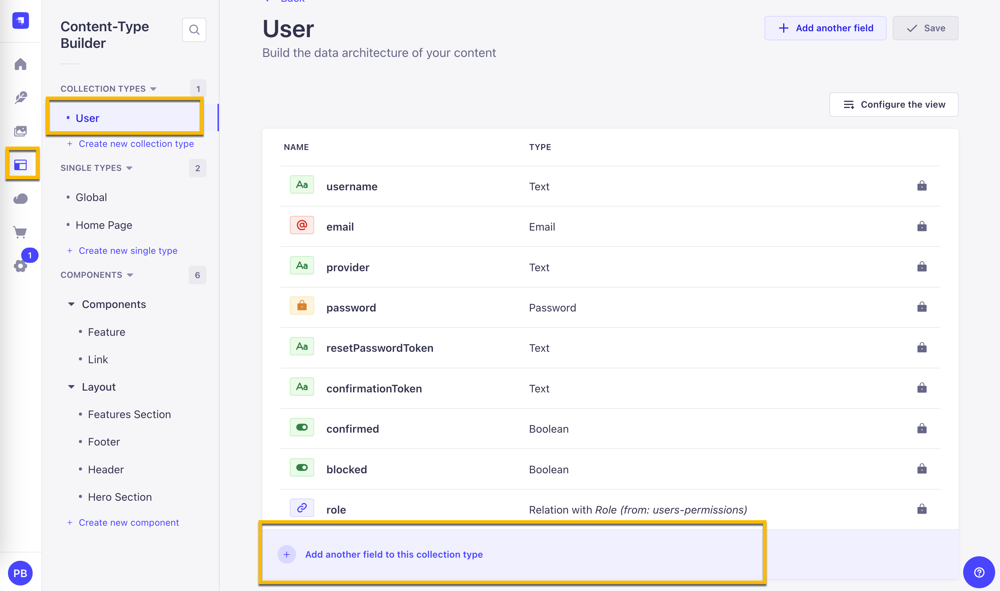

In the previous tutorial, we finished our **Home Page**, so we will build out our **Sign In** and **Sign Up** Pages and hook up the logic to allow us to sign in and sign up.

- [Part 1: Learn Next.js by building a website](https://strapi.io/blog/epic-next-js-14-tutorial-learn-next-js-by-building-a-real-life-project-part-1-2)
- [Part 2: Building Out The Hero Section of the homepage](https://strapi.io/blog/epic-next-js-14-tutorial-part-2-building-out-the-home-page)
- [Part 3: Finishup up the homepage Features Section, TopNavigation and Footer](https://strapi.io/blog/epic-next-js-14-tutorial-learn-next-js-by-building-a-real-life-project-part-3)
- [Part 4: How to handle login and Authentication in Next.js](https://strapi.io/blog/epic-next-js-14-tutorial-part-4-how-to-handle-login-and-authentication-in-next-js)
- **Part 5: Building out the Dashboard page and upload file using NextJS server actions**
- [Part 6: Get Video Transcript with OpenAI Function](https://strapi.io/blog/epic-next-js-14-tutorial-part-6-create-video-summary-with-next-js-and-open-ai)
- [Part 7: Strapi CRUD permissions](https://strapi.io/blog/epic-next-js-14-tutorial-part-7-next-js-and-strapi-crud-permissions)
- [Part 8: Search & pagination in Nextjs](https://strapi.io/blog/epic-next-js-14-tutorial-part-8-search-and-pagination-in-next-js)
- [Part 9: Backend deployment to Strapi Cloud](https://strapi.io/blog/epic-next-js-14-tutorial-part-9-backend-deployment-to-strapi-cloud)
- [Part 10: Frontend deployment to Vercel](https://strapi.io/blog/epic-next-js-14-tutorial-part-10-frontend-deployment-to-vercel)

Welcome to the next part of our React tutorial with Next.js. In the last post, we finished our Signup & Signin Page with authentication using **HTTPOnly** cookies and saw how to protect our routes via Next.js middleware.

In this section, we will be working on completing our **Dashboard** and **Profile Page**, where we will look at uploading files using NextJs server actions. At the end of the tutorial, you should be able to perform any file upload, handling of forms and server actions in Next.Js 14.

Currently, our **Dashboard** Page looks like the following. Let's create a `layout.tsx` page to give our page shared styling.


Navigate to `src/app/dashboard`, create a file called `layout.tsx,` and add the following code.

```tsx
import Link from "next/link";

export default function DashboardLayout({
  children,
}: {
  readonly children: React.ReactNode;
}) {
  return (
    <div className="h-screen grid grid-cols-[240px_1fr]">
      <nav className="border-r bg-gray-100/40 dark:bg-gray-800/40">
        <div className="flex h-full max-h-screen flex-col gap-2">
          <div className="flex h-[60px] items-center border-b px-6">
            <Link
              className="flex items-center gap-2 font-semibold"
              href="/dashboard"
            >
              <LayoutDashboardIcon className="h-6 w-6" />
              <span className="">Dashboard</span>
            </Link>
          </div>
          <div className="flex-1 overflow-auto py-2">
            <nav className="grid items-start px-4 text-sm font-medium">
              <Link
                className="flex items-center gap-3 rounded-lg px-3 py-2 text-gray-500 transition-all hover:text-gray-900 dark:text-gray-400 dark:hover:text-gray-50"
                href="/dashboard/summaries"
              >
                <ViewIcon className="h-4 w-4" />
                Summaries
              </Link>

              <Link
                className="flex items-center gap-3 rounded-lg px-3 py-2 text-gray-500 transition-all hover:text-gray-900 dark:text-gray-400 dark:hover:text-gray-50"
                href="/dashboard/account"
              >
                <UsersIcon className="h-4 w-4" />
                Account
              </Link>
            </nav>
          </div>
        </div>
      </nav>
      <main className="flex flex-col overflow-scroll">{children}</main>
    </div>
  );
}

function LayoutDashboardIcon(props: any) {
  return (
    <svg
      {...props}
      xmlns="http://www.w3.org/2000/svg"
      width="24"
      height="24"
      viewBox="0 0 24 24"
      fill="none"
      stroke="currentColor"
      strokeWidth="2"
      strokeLinecap="round"
      strokeLinejoin="round"
    >
      <rect width="7" height="9" x="3" y="3" rx="1" />
      <rect width="7" height="5" x="14" y="3" rx="1" />
      <rect width="7" height="9" x="14" y="12" rx="1" />
      <rect width="7" height="5" x="3" y="16" rx="1" />
    </svg>
  );
}

function PieChartIcon(props: any) {
  return (
    <svg
      {...props}
      xmlns="http://www.w3.org/2000/svg"
      width="24"
      height="24"
      viewBox="0 0 24 24"
      fill="none"
      stroke="currentColor"
      strokeWidth="2"
      strokeLinecap="round"
      strokeLinejoin="round"
    >
      <path d="M21.21 15.89A10 10 0 1 1 8 2.83" />
      <path d="M22 12A10 10 0 0 0 12 2v10z" />
    </svg>
  );
}

function UsersIcon(props: any) {
  return (
    <svg
      {...props}
      xmlns="http://www.w3.org/2000/svg"
      width="24"
      height="24"
      viewBox="0 0 24 24"
      fill="none"
      stroke="currentColor"
      strokeWidth="2"
      strokeLinecap="round"
      strokeLinejoin="round"
    >
      <path d="M16 21v-2a4 4 0 0 0-4-4H6a4 4 0 0 0-4 4v2" />
      <circle cx="9" cy="7" r="4" />
      <path d="M22 21v-2a4 4 0 0 0-3-3.87" />
      <path d="M16 3.13a4 4 0 0 1 0 7.75" />
    </svg>
  );
}

function ViewIcon(props: any) {
  return (
    <svg
      {...props}
      xmlns="http://www.w3.org/2000/svg"
      width="24"
      height="24"
      viewBox="0 0 24 24"
      fill="none"
      stroke="currentColor"
      strokeWidth="2"
      strokeLinecap="round"
      strokeLinejoin="round"
    >
      <path d="M5 12s2.545-5 7-5c4.454 0 7 5 7 5s-2.546 5-7 5c-4.455 0-7-5-7-5z" />
      <path d="M12 13a1 1 0 1 0 0-2 1 1 0 0 0 0 2z" />
      <path d="M21 17v2a2 2 0 0 1-2 2H5a2 2 0 0 1-2-2v-2" />
      <path d="M21 7V5a2 2 0 0 0-2-2H5a2 2 0 0 0-2 2v2" />
    </svg>
  );
}
```

Your updated UI should look like the following.


## Updating Top Header To Include Username and Logout Button

Currently, our **Top Header** does not show the user who is logged in when we are logged in. Let's go ahead and update it.

Navigate to `src/components/custom/header.tsx` and make the following changes.

First, let's import our `getUserMeLoader`, a function we created in the previous video to retrieve our users' data if they are logged in.

```jsx
import { getUserMeLoader } from "@/data/services/get-user-me-loader";
```

Next, let's call it inside our **Header** component with the following.

```jsx
const user = await getUserMeLoader();
console.log(user);
```

If you are logged in, you should see your user data in the console.

```js
{
  ok: true,
  data: {
    id: 3,
    username: 'testuser',
    email: 'testuser@email.com',
    provider: 'local',
    confirmed: true,
    blocked: false,
    createdAt: '2024-03-23T20:32:32.978Z',
    updatedAt: '2024-03-23T20:32:32.978Z'
  },
  error: null
}
```

We can use the `ok` key to conditionally render our `Sign Up` button or the user's Name and Logout Button.

Before we can do that, let's import our **Logout** Button first with the following.

```tsx
import { LogoutButton } from "./logout-button";
```

Now, let's create a simple component showing the logout button and the user name. The code is in the following snippet.

```tsx
interface AuthUserProps {
  username: string;
  email: string;
}

export function LoggedInUser({
  userData,
}: {
  readonly userData: AuthUserProps;
}) {
  return (
    <div className="flex gap-2">
      <Link
        href="/dashboard/account"
        className="font-semibold hover:text-primary"
      >
        {userData.username}
      </Link>
      <LogoutButton />
    </div>
  );
}
```

Now, let's update the following code.

```tsx
<div className="flex items-center gap-4">
  <Link href={ctaButton.url}>
    <Button>{ctaButton.text}</Button>
  </Link>
</div>
```

And replace them with the new changes.

```tsx
<div className="flex items-center gap-4">
  {user.ok ? (
    <LoggedInUser userData={user.data} />
  ) : (
    <Link href={ctaButton.url}>
      <Button>{ctaButton.text}</Button>
    </Link>
  )}
</div>
```

The completed code in our `header.tsx` file should look like the following.

```tsx
import Link from "next/link";

import { getUserMeLoader } from "@/data/services/get-user-me-loader";

import { Logo } from "@/components/custom/logo";
import { Button } from "@/components/ui/button";
import { LogoutButton } from "./logout-button";

interface HeaderProps {
  data: {
    logoText: {
      id: number;
      text: string;
      url: string;
    };
    ctaButton: {
      id: number;
      text: string;
      url: string;
    };
  };
}

interface AuthUserProps {
  username: string;
  email: string;
}

export function LoggedInUser({
  userData,
}: {
  readonly userData: AuthUserProps;
}) {
  return (
    <div className="flex gap-2">
      <Link
        href="/dashboard/account"
        className="font-semibold hover:text-primary"
      >
        {userData.username}
      </Link>
      <LogoutButton />
    </div>
  );
}

export async function Header({ data }: Readonly<HeaderProps>) {
  const user = await getUserMeLoader();
  console.log(user);
  const { logoText, ctaButton } = data;
  return (
    <div className="flex items-center justify-between px-4 py-3 bg-white shadow-md dark:bg-gray-800">
      <Logo text={logoText.text} />
      <div className="flex items-center gap-4">
        {user.ok ? (
          <LoggedInUser userData={user.data} />
        ) : (
          <Link href={ctaButton.url}>
            <Button>{ctaButton.text}</Button>
          </Link>
        )}
      </div>
    </div>
  );
}
```

Nice. Now, when you are logged in, you should see the username and Logout Buttons.

Let's make another quick change in our `hero-section.tsx` file, which is in the `src/components/custom` folder.

The cool part about React Server Components is that they can be responsible for their own data. Let's update it so that if the user is Logged In, they will see the button to take them to the Dashboard.

Let's make the following changes.

```tsx
import Link from "next/link";
import { getUserMeLoader } from "@/data/services/get-user-me-loader";
import { StrapiImage } from "@/components/custom/strapi-image";

interface ImageProps {
  id: number;
  url: string;
  alternativeText: string;
}

interface LinkProps {
  id: number;
  url: string;
  text: string;
}

interface HeroSectionProps {
  data: {
    id: number;
    __component: string;
    heading: string;
    subHeading: string;
    image: ImageProps;
    link: LinkProps;
  };
}

export async function HeroSection({ data }: Readonly<HeroSectionProps>) {
  const user = await getUserMeLoader();
  const { heading, subHeading, image, link } = data;

  const userLoggedIn = user.ok;
  const linkUrl = userLoggedIn ? "/dashboard" : link.url;

  return (
    <header className="relative h-[600px] overflow-hidden">
      <StrapiImage
        alt="Background"
        className="absolute inset-0 object-cover w-full h-full"
        height={1080}
        src={image.url}
        width={1920}
      />
      <div className="relative z-10 flex flex-col items-center justify-center h-full text-center text-white bg-black bg-opacity-20">
        <h1 className="text-4xl font-bold md:text-5xl lg:text-6xl">
          {heading}
        </h1>
        <p className="mt-4 text-lg md:text-xl lg:text-2xl">{subHeading}</p>
        <Link
          className="mt-8 inline-flex items-center justify-center px-6 py-3 text-base font-medium text-black bg-white rounded-md shadow hover:bg-gray-100"
          href={linkUrl}
        >
          {userLoggedIn ? "Dashboard" : link.text}
        </Link>
      </div>
    </header>
  );
}
```

Now, our UI in the Hero Section should look like the following if the user is logged in.


Now, let's work on our **Account** Page.

## Creating Our User Profile Page (Account Page)

Let's start by navigating our `dashboard` folder and creating an `account` folder with a `page.tsx` file.

We will add the following code.

```tsx
import { getUserMeLoader } from "@/data/services/get-user-me-loader";
// import { ProfileForm } from "@/components/forms/profile-form";
// import { ProfileImageForm } from "@/components/forms/profile-image-form";

export default async function AccountRoute() {
  const user = await getUserMeLoader();
  const userData = user.data;
  const userImage = userData?.image;

  return (
    <div className="grid grid-cols-1 lg:grid-cols-5 gap-4 p-4">
      Account Page
      {/* <ProfileForm data={userData} className="col-span-3" /> */}
      {/* <ProfileImageForm data={userImage} className="col-span-2" /> */}
    </div>
  );
}
```

I commented out the components that we still need to create to get our app to render. Let's make our **ProfileForm** and **ProfileImageForm** components.

### Create a Form To Update User's Details

Let's navigate to `src/components/forms` and create a `profile-form.tsx` file.

Let's paste in the following code.

```tsx
"use client";
import React from "react";
import { cn } from "@/lib/utils";

import { SubmitButton } from "@/components/custom/submit-button";
import { Input } from "@/components/ui/input";
import { Textarea } from "@/components/ui/textarea";

interface ProfileFormProps {
  id: string;
  username: string;
  email: string;
  firstName: string;
  lastName: string;
  bio: string;
  credits: number;
}

function CountBox({ text }: { readonly text: number }) {
  const style = "font-bold text-md mx-1";
  const color = text > 0 ? "text-primary" : "text-red-500";
  return (
    <div className="flex items-center justify-center h-9 w-full rounded-md border border-input bg-transparent px-3 py-1 text-sm shadow-sm transition-colors file:border-0 file:bg-transparent file:text-sm file:font-medium placeholder:text-muted-foreground focus-visible:outline-none">
      You have<span className={cn(style, color)}>{text}</span>credit(s)
    </div>
  );
}

export function ProfileForm({
  data,
  className,
}: {
  readonly data: ProfileFormProps;
  readonly className?: string;
}) {
  return (
    <form className={cn("space-y-4", className)}>
      <div className="space-y-4 grid ">
        <div className="grid grid-cols-3 gap-4">
          <Input
            id="username"
            name="username"
            placeholder="Username"
            defaultValue={data.username || ""}
            disabled
          />
          <Input
            id="email"
            name="email"
            placeholder="Email"
            defaultValue={data.email || ""}
            disabled
          />
          <CountBox text={data.credits} />
        </div>

        <div className="grid grid-cols-2 gap-4">
          <Input
            id="firstName"
            name="firstName"
            placeholder="First Name"
            defaultValue={data.firstName || ""}
          />
          <Input
            id="lastName"
            name="lastName"
            placeholder="Last Name"
            defaultValue={data.lastName || ""}
          />
        </div>
        <Textarea
          id="bio"
          name="bio"
          placeholder="Write your bio here..."
          className="resize-none border rounded-md w-full h-[224px] p-2"
          defaultValue={data.bio || ""}
          required
        />
      </div>
      <div className="flex justify-end">
        <SubmitButton text="Update Profile" loadingText="Saving Profile" />
      </div>
    </form>
  );
}
```

Since we use a new **Shadcn UI** component, `Textarea,` let's install it using the following:

```bash
npx shadcn@latest add textarea
```

Let's uncomment our **ProfileForm** in our `dashboard/account/page.tsx` file.

```tsx
import { getUserMeLoader } from "@/data/services/get-user-me-loader";
import { ProfileForm } from "@/components/forms/profile-form";
// import { ProfileImageForm } from "@/components/forms/profile-image-form";

export default async function AccountRoute() {
  const user = await getUserMeLoader();
  const userData = user.data;
  const userImage = userData?.image;

  return (
    <div className="grid grid-cols-1 lg:grid-cols-5 gap-4 p-4">
      Account Page
      <ProfileForm data={userData} className="col-span-3" />
      {/* <ProfileImageForm data={userImage} className="col-span-2" /> */}
    </div>
  );
}
```

Restart the app and your Next.js frontend, and you should see the following.


You should notice two things. One, we are not getting our users' **First Name**, **Last Name**, **Bio**, or the number of credits they have left.

Second, we are not able to submit the form because we have not implemented the form logic via server action yet. We will do that next. But first, let's update our user schema in Strapi.

### Updating User Data Schema In Our Backend

Inside our Strapi Admin area, navigate to the `content-builder` and choose the user collection type.



Let's add the following fields.

| Name      | Field  | Type       | Advanced Settings         |
| --------- | ------ | ---------- | ------------------------- |
| firstName | Text   | Short Text |                           |
| lastName  | Text   | Short Text |                           |
| bio       | Text   | Long Text  |                           |
| credits   | Number | Integer    | Set default value to be 0 |

We will manually add the credits for new users when they sign in, but their default starting credits should be `0`.

Once you are done, you should have the following new fields.


Now, let's manually update our users' information so we can check whether we are getting it in our front end.


Navigating to your `Account` page on your front end should see the following output.


Let's move on to the form update using **server action**.

### Updating User Data With Server Actions

First, let's create our `updateProfileAction` responsible for handling our form submission.

Navigate to `src/data/actions`, create a new file called `profile-actions` and paste in the following code.

```tsx
"use server";
import qs from "qs";

export async function updateProfileAction(
  userId: string,
  prevState: any,
  formData: FormData
) {
  const rawFormData = Object.fromEntries(formData);

  const query = qs.stringify({
    populate: "*",
  });

  const payload = {
    firstName: rawFormData.firstName,
    lastName: rawFormData.lastName,
    bio: rawFormData.bio,
  };

  console.log("updateProfileAction", userId);
  console.log("############################");
  console.log(payload);
  console.log("############################");

  return {
    ...prevState,
    message: "Profile Updated",
    data: payload,
    strapiErrors: null,
  };
}
```

We have created actions before, so there is not much new here except one small addition. Notice that we can access `userId,` which we are getting as one of the arguments.

Let's implement this action in our `ProfileForm` and see how we pass the `userId` to our action.

Navigate to your `profile-form.tsx` file and make the following changes.

First, let's import our action with the following.

```jsx
import { useFormState } from "react-dom";
import { updateProfileAction } from "@/data/actions/profile-actions";
```

Next, let's create the initial state for our `useFormState`.

```jsx
const INITIAL_STATE = {
  data: null,
  strapiErrors: null,
  message: null,
};
```

I will not focus on form validation with **Zod** since we already covered this in previous sections. It can be a great extra challenge for you to explore independently and to see how useful it is for data validation in JavaScript/TypeScript applications and frameworks such as Next.JS 14, VueJs, Remix, etc.

But we will import our **StrapiErrors** component and handle those.

```jsx
import { StrapiErrors } from "@/components/custom/strapi-errors";
```

Before using the `useFormState` as we did in previous sections, let's look at how we can bind additional data that we would like to pass to our server actions.

Add the following line of code.

```jsx
const updateProfileWithId = updateProfileAction.bind(null, data.id);
```

We can use the `bind` method to add new data that we can access inside our server action.

This is how we are setting our `userId` so that we can access it from our `updateProfileAction` server action.

You can read more about it in the Next.js documentation [here](https://nextjs.org/docs/app/building-your-application/data-fetching/server-actions-and-mutations#passing-additional-arguments).

Finally, let's use our `useFormState` hook to access the data returned from our server actions.

```jsx
const [formState, formAction] = useFormState(
  updateProfileWithId,
  INITIAL_STATE
);
```

Let's update our `form` tag with the following.

```jsx
  <form
    className={cn("space-y-4", className)}
    action={formAction}
  >
```

And remember to add our **StrapiErrors** component.

```jsx
<div className="flex justify-end">
    <SubmitButton text="Update Profile" loadingText="Saving Profile" />
</div>
<StrapiErrors error={formState?.strapiErrors} />
```

The final code should look like the following inside your `profile-form.tsx` file.

```tsx
"use client";
import React from "react";
import { cn } from "@/lib/utils";

import { useFormState } from "react-dom";
import { updateProfileAction } from "@/data/actions/profile-actions";

import { SubmitButton } from "@/components/custom/submit-button";
import { Input } from "@/components/ui/input";
import { Textarea } from "@/components/ui/textarea";
import { StrapiErrors } from "@/components/custom/strapi-errors";

const INITIAL_STATE = {
  data: null,
  strapiErrors: null,
  message: null,
};

interface ProfileFormProps {
  id: string;
  username: string;
  email: string;
  firstName: string;
  lastName: string;
  bio: string;
  credits: number;
}

function CountBox({ text }: { readonly text: number }) {
  const style = "font-bold text-md mx-1";
  const color = text > 0 ? "text-primary" : "text-red-500";
  return (
    <div className="flex items-center justify-center h-9 w-full rounded-md border border-input bg-transparent px-3 py-1 text-sm shadow-sm transition-colors file:border-0 file:bg-transparent file:text-sm file:font-medium placeholder:text-muted-foreground focus-visible:outline-none">
      You have<span className={cn(style, color)}>{text}</span>credit(s)
    </div>
  );
}

export function ProfileForm({
  data,
  className,
}: {
  readonly data: ProfileFormProps;
  readonly className?: string;
}) {
  const updateProfileWithId = updateProfileAction.bind(null, data.id);

  const [formState, formAction] = useFormState(
    updateProfileWithId,
    INITIAL_STATE
  );

  return (
    <form className={cn("space-y-4", className)} action={formAction}>
      <div className="space-y-4 grid ">
        <div className="grid grid-cols-3 gap-4">
          <Input
            id="username"
            name="username"
            placeholder="Username"
            defaultValue={data.username || ""}
            disabled
          />
          <Input
            id="email"
            name="email"
            placeholder="Email"
            defaultValue={data.email || ""}
            disabled
          />
          <CountBox text={data.credits} />
        </div>

        <div className="grid grid-cols-2 gap-4">
          <Input
            id="firstName"
            name="firstName"
            placeholder="First Name"
            defaultValue={data.firstName || ""}
          />
          <Input
            id="lastName"
            name="lastName"
            placeholder="Last Name"
            defaultValue={data.lastName || ""}
          />
        </div>
        <Textarea
          id="bio"
          name="bio"
          placeholder="Write your bio here..."
          className="resize-none border rounded-md w-full h-[224px] p-2"
          defaultValue={data.bio || ""}
          required
        />
      </div>
      <div className="flex justify-end">
        <SubmitButton text="Update Profile" loadingText="Saving Profile" />
      </div>
      <StrapiErrors error={formState?.strapiErrors} />
    </form>
  );
}
```

Let's test it and see if we can console our changes before making the API call to Strapi.

If you check your terminal, you will see the following console message.

```js
updateProfileAction 3
############################
{
  firstName: 'Paul',
  lastName: 'Brats',
  bio: 'I made this update'
}
############################
```

Notice we are getting our **userId** and the data we want to update.

Now, let's go ahead and implement the logic that will send this data to **Strapi**.

But first, let's navigate to `src/data/services`, create a new service called `mutate-data.ts`, and import the following code.

```ts
import { getAuthToken } from "./get-token";
import { getStrapiURL } from "@/lib/utils";

export async function mutateData(method: string, path: string, payload?: any) {
  const baseUrl = getStrapiURL();
  const authToken = await getAuthToken();
  const url = new URL(path, baseUrl);

  if (!authToken) throw new Error("No auth token found");

  try {
    const response = await fetch(url, {
      method: method,
      headers: {
        "Content-Type": "application/json",
        Authorization: `Bearer ${authToken}`,
      },
      body: JSON.stringify({ ...payload }),
    });
    const data = await response.json();
    return data;
  } catch (error) {
    console.log("error", error);
    throw error;
  }
}
```

Here, we are just using fetch to submit our data, but to make it more flexible and reusable, we are passing `path` and `payload` as arguments.

Let's use it on our `profile-actions.ts` file.

Let's make the following change.

```tsx
"use server";
import qs from "qs";
import { mutateData } from "@/data/services/mutate-data";

export async function updateProfileAction(
  userId: string,
  prevState: any,
  formData: FormData
) {
  const rawFormData = Object.fromEntries(formData);

  const query = qs.stringify({
    populate: "*",
  });

  const payload = {
    firstName: rawFormData.firstName,
    lastName: rawFormData.lastName,
    bio: rawFormData.bio,
  };

  const responseData = await mutateData(
    "PUT",
    `/api/users/${userId}?${query}`,
    payload
  );

  if (!responseData) {
    return {
      ...prevState,
      strapiErrors: null,
      message: "Ops! Something went wrong. Please try again.",
    };
  }

  if (responseData.error) {
    return {
      ...prevState,
      strapiErrors: responseData.error,
      message: "Failed to Register.",
    };
  }

  return {
    ...prevState,
    message: "Profile Updated",
    data: responseData,
    strapiErrors: null,
  };
}
```

Now, try to update your form, and you will get the `forbidden` message.


In order for this to work, we need to grant permission to make the changes in Strapi's Admin.


**note:** One thing to remember is that you should take an additional step to protect your **User** route by creating an additional `policy` that will only allow you to update your user data.

We will cover this as a supplement after we complete this series.

Let's try to update our profile and see if it works.


Now that we can update our profile. Let's take a look at how we can upload files in Next.js.

### Uploading Files In Next.js Using Server Actions.

We will now focus on handling file upload in **Next.js** with **Server Actions**. But before we can do that, let's create an **ImagePicker** component.

Navigate to `src/components/custom`, create a file called `image-picker.tsx,`, and paste the following code.

```jsx
"use client";
import React, { useState, useRef } from "react";
import { StrapiImage } from "./strapi-image";

import { Input } from "@/components/ui/input";
import { Label } from "@/components/ui/label";

interface ImagePickerProps {
  id: string;
  name: string;
  label: string;
  showCard?: boolean;
  defaultValue?: string;
}

function generateDataUrl(file: File, callback: (imageUrl: string) => void) {
  const reader = new FileReader();
  reader.onload = () => callback(reader.result as string);
  reader.readAsDataURL(file);
}

function ImagePreview({ dataUrl }: { readonly dataUrl: string }) {
  return (
    <StrapiImage
      src={dataUrl}
      alt="preview"
      height={200}
      width={200}
      className="rounded-lg w-full object-cover"
    />
  );
}

function ImageCard({
  dataUrl,
  fileInput,
}: {
  readonly dataUrl: string;
  readonly fileInput: React.RefObject<HTMLInputElement>;
}) {
  const imagePreview = dataUrl ? (
    <ImagePreview dataUrl={dataUrl} />
  ) : (
    <p>No image selected</p>
  );

  return (
    <div className="w-full relative">
      <div className=" flex items-center space-x-4 rounded-md border p-4">
        {imagePreview}
      </div>
      <button
        onClick={() => fileInput.current?.click()}
        className="w-full absolute inset-0"
        type="button"
      ></button>
    </div>
  );
}

export default function ImagePicker({
  id,
  name,
  label,
  defaultValue,
}: Readonly<ImagePickerProps>) {
  const fileInput = useRef<HTMLInputElement>(null);
  const [dataUrl, setDataUrl] = useState<string | null>(defaultValue ?? null);

  const handleFileChange = (e: React.ChangeEvent<HTMLInputElement>) => {
    const file = e.target.files?.[0];
    if (file) generateDataUrl(file, setDataUrl);
  };

  return (
    <React.Fragment>
      <div className="hidden">
        <Label htmlFor={name}>{label}</Label>
        <Input
          type="file"
          id={id}
          name={name}
          onChange={handleFileChange}
          ref={fileInput}
          accept="image/*"
        />
      </div>
      <ImageCard dataUrl={dataUrl ?? ""} fileInput={fileInput} />
    </React.Fragment>
  );
}
```

This component lets the user select an image in the form.

Now, let's create our **ProfileImageForm** to utilize this component.

Navigate to `src/components/forms`, create a file called `profile-image-form.tsx`, and paste it into the following code.

```tsx
"use client";
import React from "react";
// import { useFormState } from "react-dom";

import { cn } from "@/lib/utils";

// import { uploadProfileImageAction } from "@/data/actions/profile-actions";

import { SubmitButton } from "@/components/custom/submit-button";
import ImagePicker from "@/components/custom/image-picker";
import { ZodErrors } from "@/components/custom/zod-errors";
import { StrapiErrors } from "@/components/custom/strapi-errors";

interface ProfileImageFormProps {
  id: string;
  url: string;
  alternativeText: string;
}

const initialState = {
  message: null,
  data: null,
  strapiErrors: null,
  zodErrors: null,
};

export function ProfileImageForm({
  data,
  className,
}: {
  data: Readonly<ProfileImageFormProps>;
  className?: string;
}) {
  // const uploadProfileImageWithIdAction = uploadProfileImageAction.bind(
  //   null,
  //   data?.id
  // );

  // const [formState, formAction] = useFormState(
  //   uploadProfileImageWithIdAction,
  //   initialState
  // );

  return (
    <form className={cn("space-y-4", className)}>
      <div className="">
        <ImagePicker
          id="image"
          name="image"
          label="Profile Image"
          defaultValue={data?.url || ""}
        />
        {/* <ZodErrors error={formState.zodErrors?.image} />
        <StrapiErrors error={formState.strapiErrors} /> */}
      </div>
      <div className="flex justify-end">
        <SubmitButton text="Update Image" loadingText="Saving Image" />
      </div>
    </form>
  );
}
```

We have couple of the items commented out, but we will come back to them in just a moment.

But first, let's uncomment our `ProfileImageForm` in the `app/dashboard/account/page.tsx`.

The completed code should look like the following.

```tsx
import { getUserMeLoader } from "@/data/services/get-user-me-loader";
import { ProfileForm } from "@/components/forms/profile-form";
import { ProfileImageForm } from "@/components/forms/profile-image-form";

export default async function AccountRoute() {
  const user = await getUserMeLoader();
  const userData = user.data;
  const userImage = userData?.image;

  return (
    <div className="grid grid-cols-1 lg:grid-cols-5 gap-4 p-4">
      <ProfileForm data={userData} className="col-span-3" />
      <ProfileImageForm data={userImage} className="col-span-2" />
    </div>
  );
}
```

Now, let's checkout out our account page and see if we see our image picker?


Nice. Now let's add the `image` field to our user collection type in Strapi Admin.


Navigate to Content Type Builder, click on the User collection type, and click on the Add Another Field to This Collection button.


Select the `media` field.

Make sure to name it `image`, select the `Single media` option, and then navigate to the `Advanced Settings` tab.

In the advanced settings tabs, configure `allowed file types` only to include images. Once you've done this, click the `Finish` button.


Now, add an image to your user.


Finally, before we move on, we need to update our `get-user-me-loader.ts` file to include the `image` field in the `populate` query.

```ts
populate: {
  image: {
    fields: ["url", "alternativeText"],
  },
},
```

Final code should look like the following.

```ts
import qs from "qs";
import { getAuthToken } from "./get-token";
import { getStrapiURL } from "@/lib/utils";

export async function getUserMeLoader() {
  const baseUrl = getStrapiURL();

  const url = new URL("/api/users/me", baseUrl);

  url.search = qs.stringify({
    populate: {
      image: {
        fields: ["url", "alternativeText"],
      },
    },
  });

  const authToken = await getAuthToken();
  if (!authToken) return { ok: false, data: null, error: null };

  try {
    const response = await fetch(url.href, {
      method: "GET",
      headers: {
        "Content-Type": "application/json",
        Authorization: `Bearer ${authToken}`,
      },
      cache: "no-cache",
    });
    const data = await response.json();
    if (data.error) return { ok: false, data: null, error: data.error };
    return { ok: true, data: data, error: null };
  } catch (error) {
    console.log(error);
    return { ok: false, data: null, error: error };
  }
}
```

Now refresh your frontend application; you should now see your newly added user image.


Let's now create our server action to handle file upload.

## File Upload With Server Actions in Next.js

Let's navigate to `profile-actions.ts` and update the file with the following code.

```tsx
"use server";
import { z } from "zod";
import qs from "qs";

import { getUserMeLoader } from "@/data/services/get-user-me-loader";
import { mutateData } from "@/data/services/mutate-data";

import {
  fileDeleteService,
  fileUploadService,
} from "@/data/services/file-service";

export async function updateProfileAction(
  userId: string,
  prevState: any,
  formData: FormData
) {
  const rawFormData = Object.fromEntries(formData);

  const query = qs.stringify({
    populate: "*",
  });

  const payload = {
    firstName: rawFormData.firstName,
    lastName: rawFormData.lastName,
    bio: rawFormData.bio,
  };

  const responseData = await mutateData(
    "PUT",
    `/api/users/${userId}?${query}`,
    payload
  );

  if (!responseData) {
    return {
      ...prevState,
      strapiErrors: null,
      message: "Ops! Something went wrong. Please try again.",
    };
  }

  if (responseData.error) {
    return {
      ...prevState,
      strapiErrors: responseData.error,
      message: "Failed to Register.",
    };
  }

  return {
    ...prevState,
    message: "Profile Updated",
    data: responseData,
    strapiErrors: null,
  };
}

const MAX_FILE_SIZE = 5000000;

const ACCEPTED_IMAGE_TYPES = [
  "image/jpeg",
  "image/jpg",
  "image/png",
  "image/webp",
];

// VALIDATE IMAGE WITH ZOD
const imageSchema = z.object({
  image: z
    .any()
    .refine((file) => {
      if (file.size === 0 || file.name === undefined) return false;
      else return true;
    }, "Please update or add new image.")

    .refine(
      (file) => ACCEPTED_IMAGE_TYPES.includes(file?.type),
      ".jpg, .jpeg, .png and .webp files are accepted."
    )
    .refine((file) => file.size <= MAX_FILE_SIZE, `Max file size is 5MB.`),
});

export async function uploadProfileImageAction(
  imageId: string,
  prevState: any,
  formData: FormData
) {
  // GET THE LOGGED IN USER
  const user = await getUserMeLoader();
  if (!user.ok)
    throw new Error("You are not authorized to perform this action.");

  const userId = user.data.id;

  // CONVERT FORM DATA TO OBJECT
  const data = Object.fromEntries(formData);

  // VALIDATE THE IMAGE
  const validatedFields = imageSchema.safeParse({
    image: data.image,
  });

  if (!validatedFields.success) {
    return {
      ...prevState,
      zodErrors: validatedFields.error.flatten().fieldErrors,
      strapiErrors: null,
      data: null,
      message: "Invalid Image",
    };
  }

  // DELETE PREVIOUS IMAGE IF EXISTS
  if (imageId) {
    try {
      await fileDeleteService(imageId);
    } catch (error) {
      return {
        ...prevState,
        strapiErrors: null,
        zodErrors: null,
        message: "Failed to Delete Previous Image.",
      };
    }
  }

  // UPLOAD NEW IMAGE TO MEDIA LIBRARY
  const fileUploadResponse = await fileUploadService(data.image);

  if (!fileUploadResponse) {
    return {
      ...prevState,
      strapiErrors: null,
      zodErrors: null,
      message: "Ops! Something went wrong. Please try again.",
    };
  }

  if (fileUploadResponse.error) {
    return {
      ...prevState,
      strapiErrors: fileUploadResponse.error,
      zodErrors: null,
      message: "Failed to Upload File.",
    };
  }
  const updatedImageId = fileUploadResponse[0].id;
  const payload = { image: updatedImageId };

  // UPDATE USER PROFILE WITH NEW IMAGE
  const updateImageResponse = await mutateData(
    "PUT",
    `/api/users/${userId}`,
    payload
  );

  return {
    ...prevState,
    data: updateImageResponse,
    zodErrors: null,
    strapiErrors: null,
    message: "Image Uploaded",
  };
}
```

The above server action handles the following steps.

1. First, check if the user is logged in and identifies their account.
2. It then checks the image the user selected to ensure it's a valid image type (like JPEG or PNG) and not too large in file size.
3. If the image is valid, and there was previously an image, the old image is removed.
4. The new image is uploaded to the server and associated with the user's profile.
5. The application updates the user's profile with this new image. If there's an error, it informs the user.

In essence, this code is about two main actions on a user's profile in an application: updating personal details and changing the profile picture.

It ensures that the data is valid via **Zod** and communicates with the server to store these changes, providing feedback to the user based on whether these actions were successful.

To check if the image is valid, we use the `refine` method in **Zod**, which allows us to create custom validation logic.

Let's briefly review the use of `refine` in the code below.

```ts
const imageSchema = z.object({
  image: z
    .any()
    .refine((file) => {
      if (file.size === 0 || file.name === undefined) return false;
      else return true;
    }, "Please update or add new image.")

    .refine(
      (file) => ACCEPTED_IMAGE_TYPES.includes(file?.type),
      ".jpg, .jpeg, .png and .webp files are accepted."
    )
    .refine((file) => file.size <= MAX_FILE_SIZE, `Max file size is 5MB.`),
});
```

**Why Use refine**
Flexibility and Precision: Refines allow for custom validations beyond basic type checks, which means you can implement complex, tailored criteria for data validity.

User Feedback: By specifying an error message with each refine, you provide clear, actionable feedback, improving the user experience by guiding them through correcting their input.

Composition: Multiple refine validations can be chained together, allowing for a comprehensive and readable sequence of checks.

You can learn more about using `refine` [here](https://zod.dev/?id=refine).

Finally, let's create our two services, **fileDeleteService** and **fileUploadService**. They will be responsible for deleting an existing image and uploading a new one.

Navigate to `src/data/services` and create a file named `file-service.ts` and paste in the following code.

To learn more about `file upload` in Strapi, see the [docs](https://docs.strapi.io/dev-docs/plugins/upload#endpoints).

```ts
import { getAuthToken } from "@/data/services/get-token";
import { mutateData } from "@/data/services/mutate-data";
import { getStrapiURL } from "@/lib/utils";

export async function fileDeleteService(imageId: string) {
  const authToken = await getAuthToken();
  if (!authToken) throw new Error("No auth token found");

  const data = await mutateData("DELETE", `/api/upload/files/${imageId}`);
  return data;
}

export async function fileUploadService(image: any) {
  const authToken = await getAuthToken();
  if (!authToken) throw new Error("No auth token found");

  const baseUrl = getStrapiURL();
  const url = new URL("/api/upload", baseUrl);

  const formData = new FormData();
  formData.append("files", image, image.name);

  try {
    const response = await fetch(url, {
      headers: { Authorization: `Bearer ${authToken}` },
      method: "POST",
      body: formData,
    });

    const dataResponse = await response.json();

    return dataResponse;
  } catch (error) {
    console.error("Error uploading image:", error);
    throw error;
  }
}
```

Finally, navigate back to `profile-image-form.tsx` file and uncomment previously commented code. And make sure to add `action={formAction}` to our form element.

The following code should look like the code below.

```tsx
"use client";
import React from "react";
import { useFormState } from "react-dom";

import { cn } from "@/lib/utils";

import { uploadProfileImageAction } from "@/data/actions/profile-actions";

import { SubmitButton } from "@/components/custom/submit-button";
import ImagePicker from "@/components/custom/image-picker";
import { ZodErrors } from "@/components/custom/zod-errors";
import { StrapiErrors } from "@/components/custom/strapi-errors";

interface ProfileImageFormProps {
  id: string;
  url: string;
  alternativeText: string;
}

const initialState = {
  message: null,
  data: null,
  strapiErrors: null,
  zodErrors: null,
};

export function ProfileImageForm({
  data,
  className,
}: {
  data: Readonly<ProfileImageFormProps>;
  className?: string;
}) {
  const uploadProfileImageWithIdAction = uploadProfileImageAction.bind(
    null,
    data?.id
  );

  const [formState, formAction] = useFormState(
    uploadProfileImageWithIdAction,
    initialState
  );

  return (
    <form className={cn("space-y-4", className)} action={formAction}>
      <div className="">
        <ImagePicker
          id="image"
          name="image"
          label="Profile Image"
          defaultValue={data?.url || ""}
        />
        <ZodErrors error={formState.zodErrors?.image} />
        <StrapiErrors error={formState.strapiErrors} />
      </div>
      <div className="flex justify-end">
        <SubmitButton text="Update Image" loadingText="Saving Image" />
      </div>
    </form>
  );
}
```

Before we can test whether our image uploader works, let's change our Strapi setting to enable file upload and deletion.

These options are under `Settings` => `USERS & PERMISSIONS PLUGIN` => `Roles` => `Authenticated` => `Upload`.

Check both `upload` and `destroy` boxes.


Let's test out our upload functionality.


Excellent, we now have our file upload working.

The following post will look at handling our video summary generation.

## Conclusion

Excellent. We completed our initial **Dashboard** layout with an **Account** section where the user can update their `first name`, `last name`, `bio`, and `image`.

We covered how to handle file uploads using NextJs server actions. By this point, you should be starting to feel more comfortable working with forms, file upload and server actions in Next.js.

In the next post, we will start working on our main feature, which will allow us to summarize our YouTube videos.

See you in the next one.

Also, if you made it this far, thank you. I really appreciate your support. I did my best to do diligence, but if you find errors, share them in the comments below.

If you have any questions, you can ask them in the comments or stop by Strapi's `open office` on Discord from 12:30 pm CST to 1:30 pm CST Monday through Friday.
