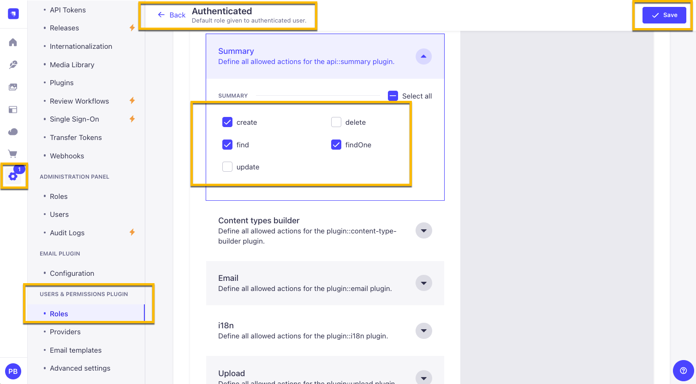
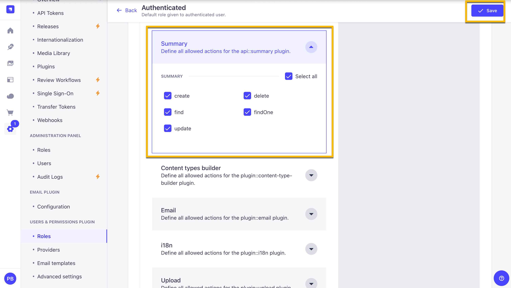
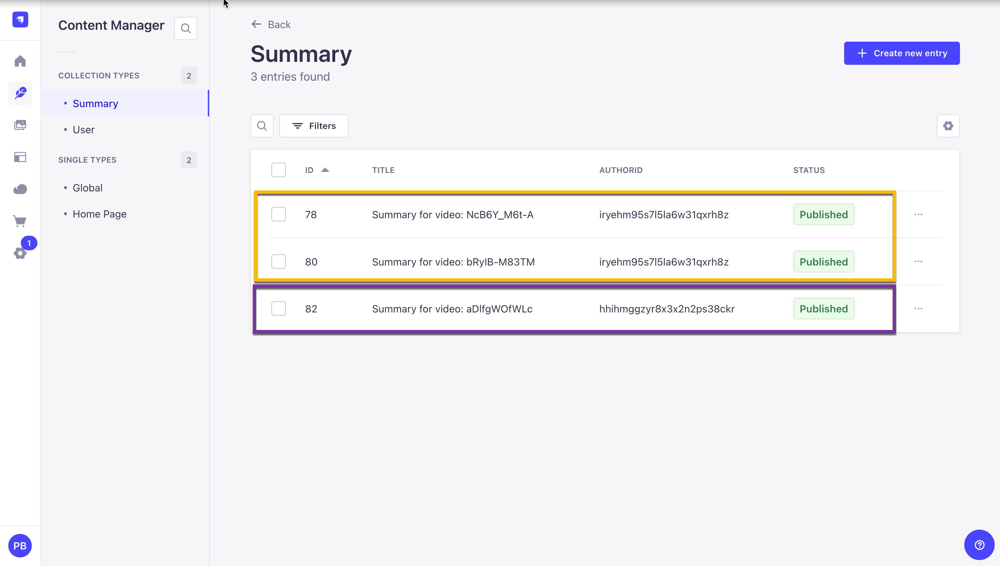
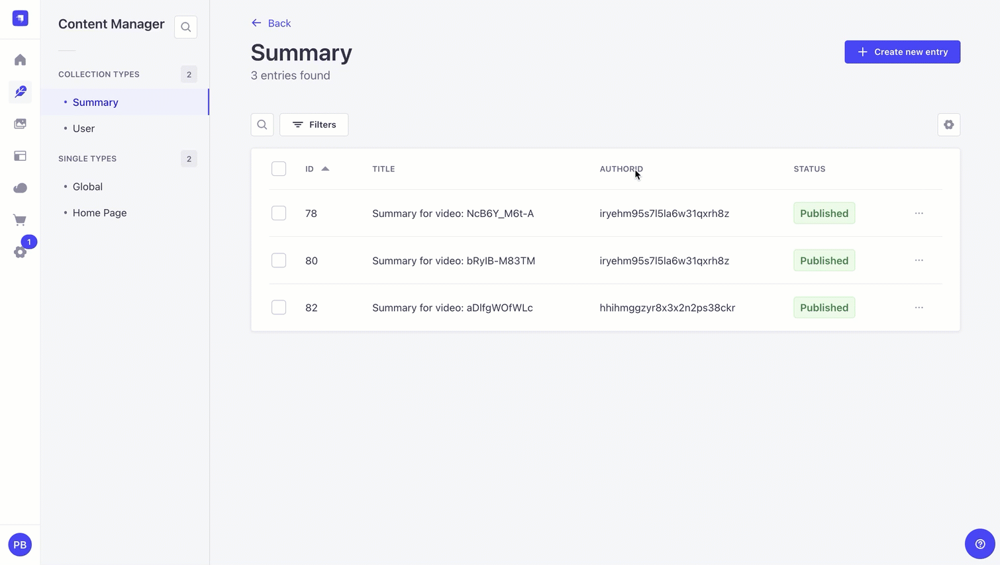

Welcome back to our Epic Next.js tutorial series!

Last time, we learned how to generate summaries using OpenAI and save them into our database.

- [Part 1: Learn Next.js by building a website](https://strapi.io/blog/epic-next-js-14-tutorial-learn-next-js-by-building-a-real-life-project-part-1-2)
- [Part 2: Building Out The Hero Section of the homepage](https://strapi.io/blog/epic-next-js-14-tutorial-part-2-building-out-the-home-page)
- [Part 3: Finish up up the homepage Features Section, TopNavigation and Footer](https://strapi.io/blog/epic-next-js-14-tutorial-learn-next-js-by-building-a-real-life-project-part-3)
- [Part 4: How to handle login and Authentication in Next.js](https://strapi.io/blog/epic-next-js-14-tutorial-part-4-how-to-handle-login-and-authentication-in-next-js)
- [Part 5: File upload using server actions](https://strapi.io/blog/epic-next-js-14-tutorial-part-5-file-upload-using-server-actions)
- [Part 6: Get Video Transcript with OpenAI Function](https://strapi.io/blog/epic-next-js-14-tutorial-part-6-create-video-summary-with-next-js-and-open-ai)
- **Part 7: Strapi CRUD permissions**
- [Part 8: Search & pagination in Nextjs](https://strapi.io/blog/epic-next-js-14-tutorial-part-8-search-and-pagination-in-next-js)
- [Part 9: Backend deployment to Strapi Cloud](https://strapi.io/blog/epic-next-js-14-tutorial-part-9-backend-deployment-to-strapi-cloud)
- [Part 10: Frontend deployment to Vercel](https://strapi.io/blog/epic-next-js-14-tutorial-part-10-frontend-deployment-to-vercel)


Today, we'll take a look at how to update and delete our summaries while ensuring that only an authorized user can do this, as well as how to inject custom middleware on to `users-permission` plugin to allow users to update only their bio.

We must ensure that only the right people can change or delete information.

We'll tackle this challenge using Strapi's route middleware, ensuring only authorized users can interact with their summaries.

## Quick CRUD Refresher

Let's briefly revisit the basics of CRUD—Create, Read, Update, and Delete—essential operations for any web application:

- **Create (POST)**: This method sends data to the server to create a new resource, like a summary.

- **Read (GET)**: GET requests to retrieve data from the server, such as loading summary details.

- **Update (PUT)**: Used for modifying an existing resource, like updating a user's bio.

- **Delete (DELETE)**: Removes resources, such as deleting a user's summary.

### Implementing CRUD Operations

To better understand how to interact with our database, here's how Strapi maps CRUD operations to specific HTTP methods and routes:

Create Summary: POST `/api/summaries`
Find Summaries: GET `/api/summaries`
Find One Summary: GET `/api/summaries/:id`
Update Summary: PUT `/api/summaries/:id`
Delete Summary: DELETE `/api/summaries/:id`

### Strapi Workflow Explained

Here's a basic breakdown of what happens in Strapi when a request is made:

- **Make a Request**: A client (like a browser or mobile app) sends a request to the server.

- **Hit a Route**: The request reaches Strapi and matches one of the predefined routes.

- **Call the Controller**: The route triggers a controller function that handles the specifics of the request, such as retrieving data, updating a record, or deleting an item.

- **Managing Authorized Requests with JWT Tokens**: Strapi uses JSON Web Tokens (JWT) to ensure that each request is legitimate.
  **Here's how it works**: Users who log in receive a JWT, which must be included as a **'Bearer token'** in the header of subsequent requests. This token is validated on each request to ensure it's still valid and that the user is authenticated. However, authenticating a request doesn't automatically mean it's authorized. Just because a user is logged in and has a token doesn't mean they should be able to modify any data they want. We need to define the logic that will prevent users from modifying data that isn't theirs.
  > **Note**: Strapi does not handle this out of the box, so we need to write custom logic within our middleware.

## Understanding Route Middleware

Route middleware in Strapi acts as a security checkpoint for each request, where we can add additional checks, such as such as whether the user is authorized to update or delete content.

### How Route Middleware Works


- **Intercept Requests**: Middleware functions intercept incoming requests before they reach their final destination.

- **Check Permissions**: It assesses whether the user's token grants them the right to perform the requested action.

- **Allow or Deny Access**: If the user lacks necessary permissions, the middleware denies access and may return a response like "403 Forbidden".

Read more about Strapi middlewares [here](https://docs.strapi.io/dev-docs/backend-customization/middlewares).

This system prevents unauthorized data modification and helps maintain a clear separation of duties within the application, simplifying management and enhancing security.

This approach enhances security and helps maintain a clean separation of concerns within the application, making the codebase more straightforward to manage and scale.

Now that we know we need to create our own middleware to handle the authorization check, let's implement our form logic first, then add the middleware.

## Setting Up Summary Update Logic

In your project's frontend, navigate to the following file `summary-card-form.tsx`.

You should see the following code that we added in the previous tutorial.

```tsx
// import { updateSummaryAction, deleteSummaryAction } from "@/data/actions/summary-actions";

import { Input } from "@/components/ui/input";
import { Textarea } from "@/components/ui/textarea";
import { cn } from "@/lib/utils";

import {
  Card,
  CardContent,
  CardFooter,
  CardHeader,
  CardTitle,
} from "@/components/ui/card";

import { SubmitButton } from "@/components/custom/submit-button";
import { DeleteButton } from "@/components/custom/delete-button";

export function SummaryCardForm({
  item,
  className,
}: {
  readonly item: any;
  readonly className?: string;
}) {
  // const deleteSummaryById = deleteSummaryAction.bind(null, item.documentId);

  return (
    <Card className={cn("mb-8 relative h-auto", className)}>
      <CardHeader>
        <CardTitle>Video Summary</CardTitle>
      </CardHeader>
      <CardContent>
        <div>
          <form>
            <Input
              id="title"
              name="title"
              placeholder="Update your title"
              required
              className="mb-4"
              defaultValue={item.title}
            />
            <Textarea
              name="summary"
              className="flex w-full rounded-md bg-transparent px-3 py-2 text-sm shadow-sm placeholder:text-muted-foreground focus-visible:outline-none focus-visible:bg-gray-50 focus-visible:ring-1 focus-visible:ring-ring disabled:cursor-not-allowed disabled:opacity-50 mb-4 h-[calc(100vh-245px)]"
              defaultValue={item.summary}
            />
            <input type="hidden" name="id" value={item.documentId} />
            <SubmitButton
              text="Update Summary"
              loadingText="Updating Summary"
            />
          </form>
          <form>
            <DeleteButton className="absolute right-4 top-4 bg-red-700 hover:bg-red-600" />
          </form>
        </div>
      </CardContent>
      <CardFooter></CardFooter>
    </Card>
  );
}
```

In the code above, we have yet to implement our `updateSummaryAction` and `deleteSummaryAction.`

Let's start with adding our new server actions; let's navigate to our `src/data/actions` folder, and, in the file name `summary-actions.ts,`, add update with the following code.

```tsx
"use server";

import { getAuthToken } from "@/data/services/get-token";
import { mutateData } from "@/data/services/mutate-data";
import { redirect } from "next/navigation";
import { revalidatePath } from "next/cache";

interface Payload {
  data: {
    title?: string;
    videoId: string;
    summary: string;
  };
}

export async function createSummaryAction(payload: Payload) {
  const authToken = await getAuthToken();
  if (!authToken) throw new Error("No auth token found");

  const data = await mutateData("POST", "/api/summaries", payload);

  if (data.error) {
    throw new Error(data.error.message);
  }

  redirect("/dashboard/summaries/" + data.data.documentId);
}

export async function updateSummaryAction(prevState: any, formData: FormData) {
  const rawFormData = Object.fromEntries(formData);
  const id = rawFormData.id as string;

  const payload = {
    data: {
      title: rawFormData.title,
      summary: rawFormData.summary,
    },
  };

  const responseData = await mutateData("PUT", `/api/summaries/${id}`, payload);

  if (!responseData) {
    return {
      ...prevState,
      strapiErrors: null,
      message: "Oops! Something went wrong. Please try again.",
    };
  }

  if (responseData.error) {
    return {
      ...prevState,
      strapiErrors: responseData.error,
      message: "Failed to update summary.",
    };
  }

  revalidatePath("/dashboard/summaries");

  return {
    ...prevState,
    message: "Summary updated successfully",
    data: responseData,
    strapiErrors: null,
  };
}

export async function deleteSummaryAction(id: string, prevState: any) {
  

  const responseData = await mutateData("DELETE", `/api/summaries/${id}`);

  if (!responseData) {
    return {
      ...prevState,
      strapiErrors: null,
      message: "Oops! Something went wrong. Please try again.",
    };
  }

  redirect("/dashboard/summaries");
}

```

You will notice that we are using `revalidatePath` imported from `next/cache`. You can learn more about it in the Next.js docs [here](https://nextjs.org/docs/app/api-reference/functions/revalidatePath).

After our summary update, this will insure that our data is revalidated after update at the `/dashboard/summaries` path.

Now that we have both server actions to handle update and delete let's navigate back to our `summary-card-form.tsx` file.

Let's start by uncommenting our server actions import.

```tsx
import {
  updateSummaryAction,
  deleteSummaryAction,
} from "@/data/actions/summary-actions";
```

Then, let's import the following to access the form state for error handling.

```tsx
import { useFormState } from "react-dom";
```

Don't forget, since we are using `useFormState` we need to add `"use client";` at the top of the file.

Now, let's set the default state to the following:

```tsx
const INITIAL_STATE = {
  strapiErrors: null,
  data: null,
  message: null,
};
```

Let's connect our actions with our `formState` by adding the following.

```tsx
const deleteSummaryById = deleteSummaryAction.bind(null, item.id);

const [deleteState, deleteAction] = useFormState(
  deleteSummaryById,
  INITIAL_STATE
);

const [updateState, updateAction] = useFormState(
  updateSummaryAction,
  INITIAL_STATE
);
```

Based on what we have already covered, this should all start looking familiar. We are using `useFormState` to get our return from our server actions to display our errors on our frontend.

Now that we have our `deleteAction` and `updateAction,` we must add these to the respectful forms via the action attribute.

```tsx
<form action={updateAction}>
  <Input
    id="title"
    name="title"
    placeholder="Update your title"
    required
    className="mb-4"
    defaultValue={item.title}
  />
  <Textarea
    name="summary"
    className="flex w-full rounded-md bg-transparent px-3 py-2 text-sm shadow-sm placeholder:text-muted-foreground focus-visible:outline-none focus-visible:bg-gray-50 focus-visible:ring-1 focus-visible:ring-ring disabled:cursor-not-allowed disabled:opacity-50 mb-4 h-[calc(100vh-245px)] "
    defaultValue={item.summary}
  />
  <input type="hidden" name="id" value={item.id} />
  <SubmitButton text="Update Summary" loadingText="Updating Summary" />
</form>
```

```tsx
<form action={deleteAction}>
  <DeleteButton className="absolute right-4 top-4 bg-red-700 hover:bg-red-600" />
</form>
```

Finally, let's import our `StrapiError` component with the following.

```tsx
import { StrapiErrors } from "@/components/custom/strapi-errors";
```

And use it in our card footer.

```tsx
<CardFooter>
  <StrapiErrors
    error={deleteState?.strapiErrors || updateState?.strapiErrors}
  />
</CardFooter>
```

The completed code should look like the following.

```tsx
"use client";
import {
  updateSummaryAction,
  deleteSummaryAction,
} from "@/data/actions/summary-actions";
import { useFormState } from "react-dom";

import { Input } from "@/components/ui/input";
import { Textarea } from "@/components/ui/textarea";
import { StrapiErrors } from "@/components/custom/strapi-errors";
import { cn } from "@/lib/utils";

import {
  Card,
  CardContent,
  CardFooter,
  CardHeader,
  CardTitle,
} from "@/components/ui/card";

import { SubmitButton } from "@/components/custom/submit-button";
import { DeleteButton } from "@/components/custom/delete-button";

const INITIAL_STATE = {
  strapiErrors: null,
  data: null,
  message: null,
};

export function SummaryCardForm({
  item,
  className,
}: {
  readonly item: any;
  readonly className?: string;
}) {
  const deleteSummaryById = deleteSummaryAction.bind(null, item.documentId);

  const [deleteState, deleteAction] = useFormState(
    deleteSummaryById,
    INITIAL_STATE
  );

  const [updateState, updateAction] = useFormState(
    updateSummaryAction,
    INITIAL_STATE
  );
  return (
    <Card className={cn("mb-8 relative h-auto", className)}>
      <CardHeader>
        <CardTitle>Video Summary</CardTitle>
      </CardHeader>
      <CardContent>
        <div>
          <form action={updateAction}>
            <Input
              id="title"
              name="title"
              placeholder="Update your title"
              required
              className="mb-4"
              defaultValue={item.title}
            />
            <Textarea
              name="summary"
              className="flex w-full rounded-md bg-transparent px-3 py-2 text-sm shadow-sm placeholder:text-muted-foreground focus-visible:outline-none focus-visible:bg-gray-50 focus-visible:ring-1 focus-visible:ring-ring disabled:cursor-not-allowed disabled:opacity-50 mb-4 h-[calc(100vh-245px)] "
              defaultValue={item.summary}
            />
            <input type="hidden" name="id" value={item.documentId} />
            <SubmitButton
              text="Update Summary"
              loadingText="Updating Summary"
            />
          </form>
          <form action={deleteAction}>
            <DeleteButton className="absolute right-4 top-4 bg-red-700 hover:bg-red-600" />
          </form>
        </div>
      </CardContent>
      <CardFooter>
        <StrapiErrors
          error={deleteState?.strapiErrors || updateState?.strapiErrors}
        />
      </CardFooter>
    </Card>
  );
}
```

Now, let's test out our frontend. I disabled `delete` and `update` under user permission for authenticated users.



So, if we try to `delete` or `update` our summary, we should see the `forbidden` message in our card footer.


Excellent, we can tell our errors are working. Let's set the following permissions again and see if our update and delete functions work.



You should now see that you can update and delete your content.


But we have one small issue. When we make a `GET` request to the `/api/summaries` endpoint, we get all the summaries. And we want to make sure that we only get the summaries for the user that is logged in.



Here in Strapi Admin, you can see that I have two summaries from two different users. Still, in the frontend, you can see that I have access to all the summaries.


I should only see the summaries from the user that is logged in. But instead, I see all the summaries.

Let's fix this by creating a new middleware in the next section.

## Create Is Owner Middleware In Strapi

Let's create a new middleware to only show summaries from the user who is logged in by applying a filter inside of our middleware.

### Using Strapi CLI To Generate Middleware

Let's start in our Strapi project folder, so make sure you are on the backend of your project and run the following command.

```bash
yarn strapi generate
```

Select the `middleware` option.

```bash
➜  backend git:(main) ✗ yarn strapi generate
yarn run v1.22.22
$ strapi generate
? Strapi Generators 
  api - Generate a basic API 
  controller - Generate a controller for an API 
  content-type - Generate a content type for an API 
  policy - Generate a policy for an API 
❯ middleware - Generate a middleware for an API 
  migration - Generate a migration 
  service - Generate a service for an API 
```

I am going to call my middleware `is-owner` and we will add it to the root of the project.

```bash
? Middleware name is-owner
? Where do you want to add this middleware? (Use arrow keys)
❯ Add middleware to root of project 
  Add middleware to an existing API 
  Add middleware to an existing plugin 
```

Select the `Add middleware to root of project` option and press `Enter`.

```bash
✔  ++ /middlewares/is-owner.js
✨  Done in 327.55s.
```

Our middleware is located in the root of our project, in a folder called `src/middlewares` inside the `is-owner` file.

It will have this basic template code.

```js
/**
 * `is-owner` middleware
 */

import type { Core } from '@strapi/strapi';

export default (config, { strapi }: { strapi: Core.Strapi }) => {
  // Add your own logic here.
  return async (ctx, next) => {
    strapi.log.info('In is-owner middleware.');

    await next();
  };
};
```

Let's update the code with the following.

```js
/**
 * `is-owner` middleware
 */

import type { Core } from "@strapi/strapi";

export default (config, { strapi }: { strapi: Core.Strapi }) => {
  // Add your own logic here.
  return async (ctx, next) => {
    strapi.log.info("In is-owner middleware.");

    const entryId = ctx.params.id;
    const user = ctx.state.user;
    const userId = user?.documentId;

    if (!userId) return ctx.unauthorized(`You can't access this entry`);

    const apiName = ctx.state.route.info.apiName;

    function generateUID(apiName) {
      const apiUid = `api::${apiName}.${apiName}`;
      return apiUid;
    }

    const appUid = generateUID(apiName);

    if (entryId) {
      const entry = await strapi.documents(appUid as any).findOne({
        documentId: entryId,
        populate: "*",
      });

      if (entry && entry.authorId !== userId)
        return ctx.unauthorized(`You can't access this entry`);
    }

    if (!entryId) {
      ctx.query = {
        ...ctx.query,
        filters: { ...ctx.query.filters, authorId: userId },
      };
    }

    await next();
  };
};

```

The code above will check for two cases. If `entryId` exists, that means we are calling the `findOne` route. In this case, we search for the entry and check if the `userId` is the same as the logged-in user. If that is the case, go ahead and return the entry.

In the second case, if there is no `entryId`, we assume that we are making a `GET` request, in which case filter the content by `userId`.

Before we can test the middleware, we need to add the appropriate routes.

In Strapi, navigate to the following folder and file `src/api/summary/routes/summary.js,` and you should see this code.

```js
/**
 * summary router
 */

import { factories } from "@strapi/strapi";

export default factories.createCoreRouter("api::summary.summary", {
  config: {
    create: {
      middlewares: ["api::summary.on-summary-create"],
    },
  },
});

```

We have already added middleware to our `create` route. Let's do the same for `find`, `findOne`, `update`, and `delete`.

Completed code with the changes should look like the following.

```js
/**
 * summary router
 */

import { factories } from "@strapi/strapi";

export default factories.createCoreRouter("api::summary.summary", {
  config: {
    create: {
      middlewares: ["api::summary.on-summary-create"],
    },
    find: {
      middlewares: ["global::is-owner"],
    },
    findOne: {
      middlewares: ["global::is-owner"],
    },
    update: {
      middlewares: ["global::is-owner"],
    },
    delete: {
      middlewares: ["global::is-owner"],
    },
  },
});

```

Whenever any of these routes get called, it will trigger our middleware that will either reject the request or approve it based on our logic.

Let's restart our Strapi backend and see if we are only able to see the post for the appropriate user.



## Conclusion

In this tutorial, we focused on making our app more secure and user-friendly by setting up CRUD operations that are specific to each user. This way, each person can only update or delete their own summaries, adding a strong layer of protection and control. With custom middleware handling these checks, we made sure that users see only their own content and that any attempts to view or change someone else’s data are blocked.

Here’s a quick summary of everything we covered:

1. **Setting up CRUD operations** for summaries in Strapi, allowing users to create, read, update, and delete their own data.
2. **Creating custom middleware** to check user permissions and limit access based on the logged-in user’s ID.
3. **Filtering content** so each user only sees their own summaries, making the app more organized and secure.
4. **Adding error handling** for unauthorized actions, ensuring users receive clear feedback if they try to access data they shouldn’t.
5. **Testing our middleware** to confirm that only authorized users can update or delete their own summaries.
6. **Configuring routes in Strapi** to apply our custom middleware for create, read, update, and delete actions.

This setup combines Strapi’s middleware with Next.js to create a simple and secure app that works well even as more users join. Now, each user has a clear view of their own data, and we’re keeping everything safe by preventing unauthorized access.

In the next part, we’ll keep building out new features to make this app even better. Thanks for following along, and happy coding! See you in the next tutorial!


